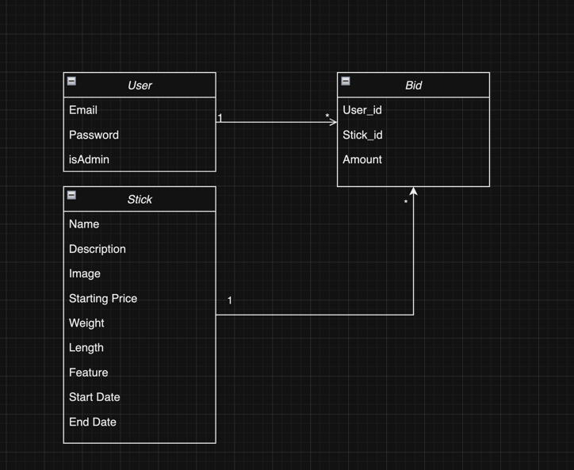

## Class Diagram
I have created a class diagram for the project. 
It shows the general model of the data and properties of the classes.
As you can see, a user can have many bids. Bid is somewhat a junction table between User and Auction.
Auction can have many bids. 

## Explanation of choices

### Tailwind CSS
I always heard about how cool Tailwind was, but never actually tried it myself. 
I am used to writing CSS therefore I have decent knowledge of it. During web basics I have designed my own 
utility class system to avoid bloating CSS with unnecessary classes. For me, Tailwind took it even to a higher level.
It is incredibly easy to get started and adjust it to your needs (e.g. setup brand colors or different sizing). 
It was really an enjoyable learning experience and I can see myself using it in future projects.

### Backend 
The first thing that came to my mind was find a way to model the data. I thought of using typescript, but since I am not really familiar with it,
I decided not to risk it. Unfortunately, I found out about `Zod` when I was already done with the entire project. I have modeled three Javascript classes,
representing the data. I am not really a fan of this approach, since it is not really scalable and DEFINITELY not really maintainable. If I were using some sort of
schema validator, that would be much faster and required less code. But in the end of the day, my approach was ok. Most of the validation is done within a class.
I exported functions needed for validation, so I reused them. I really like the concern separation of that.

I tried to avoid repetitive code and created utils for requests and tokens.

I also experimented with some third-party packages. Set up my `.env` variables and used `validator` package for emails (instead of 50 lines of regex)

### Frontend
I have played around with Tailwind and created a simple design. In the beginning, I struggled with Svelte a bit, but by the end of the project,
I know have solid understanding of it. Most of the time, when I needed to fetch data I declared a promise and used it in `{#await}` block. That was nice and straightforward, 
but in one place I decided to experiment with manual data processing. I did this in Admins dashboard "Auctions tab". I wanted to test other approaches to fetching data. For me
both were fine, although I have to admin that letting Svelte handle your promise change and re-fetch depended components for you is much easier that managing this state yourself.
I had to introduce `loading` variable to display the loading animation, whilst it is default behavior in `{#await}` svelte block. Definitely will be using easier approach, because 
of its simplicity.

I have experimented with minor accessibility features, like being able to close some focused elements on 
"ESC" and generally use keyboard for intuitive actions (Like hitting enter to place bid, or create new auction)

### Conclusion
That was by far my favorite course of all. I have really enjoyed working both and backend. I like the freedom of choice and assignment being not really explicit.
Loved experimenting with libraries and packages. By far, I am happy with the results. 

