# Testing

## Traceability matrix

### Functional

The table below shows an overview of which test covers which functional requirements
`U` – **untestable requirement, that was met**

| Test | F1 | F2 | F3 | F4 | F5 | F6 | F7 | F8 | F9 | F10 | 
|:----:|:--:|:--:|:--:|:--:|:--:|:--:|:--:|:--:|:--:|:---:|
|  T1  | X  | X  |    |    |    |    |    |    |    |     |
|  T2  |    |    | X  |    |    |    |    |    |    |     |
|  T3  |    |    |    | U  |    |    |    | X  | X  |     |
|  T4  |    |    |    |    |    |    | X  |    |    |     |
|  T5  |    |    |    |    | X  |    |    |    |    |     |
|  T6  |    |    |    |    |    |    |    |    |    |  X  |
|  T7  |    |    |    |    |    | X  |    |    |    |     |

### Non funtional
`U` – **untestable requirement, that was met**

The table below shows an overview of which test covers which non-functional requirements

| Test | NF1 | NF2 | NF3 | NF4 | NF5 | NF6 | NF7 | NF8 | NF9 | NF10 | NF11 | NF12 | NF13 | NF14 | NF15 | NF16 | NF17 | NF18 | NF19 | 
|:----:|:---:|:---:|:---:|:---:|:---:|:---:|:---:|:---:|:---:|:----:|:----:|:----:|:----:|:----:|:----:|:----:|:----:|:----:|:----:|
|  U   |  X  |  X  |  X  |  X  |     |     |     |     |  X  |      |  X   |      |  X   |  X   |  X   |  X   |  X   |  X   |      |
|  T3  |     |     |     |     |     |     |     |  X  |     |      |      |  X   |      |      |      |      |      |      |      |
|  T4  |     |     |     |     |  X  |  X  |     |     |     |      |      |      |      |      |      |      |      |      |      |
|  T7  |     |     |     |     |     |     |     |     |     |  X   |      |      |      |      |      |      |      |      |      |

## Test plan

### Prerequisites:
- Install dependencies both from client and server
- Run the server using `npm run dev`
- Run the client using `npm run dev`

### T1: View all auctions and a specific auction
1. Open the client in the browser (`http://localhost:5173/`)
2. Check if the list of auctionable products or services is displayed on the screen
3. Click on a `View Details` button on any auction
4. Check if the mandatory details (end date, bid list, product name, price) are displayed on the screen

### T2: Search for an auction
1. Open the client in the browser (`http://localhost:5173/`)
2. Focus on the search bar
3. Type in a search query `ma`
4. Ensure two stick auctions are displayed (`Mystery Mace`, `Hitman's Stick`)

### T3: Bids placement  
1. Open the client in the browser (`http://localhost:5173/`)
2. Click `Register` button
3. Fill in the registration form with `user@test.com, Testing123` and register
4. Open `Mystery Mace` auction as registered user 
5. Open incognito mode in the browser and open the client (`http://localhost:5173/`)
6. Open `Mystery Mace` auction in both browsers 
7. Place a bid on the auction in the first browser (as a logged-in user)
8. Check if the bid is displayed in the second browser 
9. Ensure the bid it stays there, after refreshing the page 
10. Ensure you are unable to put bid in a second browser window (as a not logged-in user) by seeing that button is disabled

### T4: Filtering auctions
1. Open the client in the browser (`http://localhost:5173/`)
2. Try to prefill this url in the browser: `http://localhost:5173/?length=short&length=medium&weight=medium&feature=straight`
3. Ensure correct checkboxes are checked in the filter section (length: short, medium; feature: straight; weight: medium)
4. Ensure only `Hobbit Stick` auction is displayed
5. Reset the filters by clicking on the `Reset filters` button
6. Order filters by price in ascending and descending order by clicking the arrow near the `Price` label

### T5: Client validation when placing bid
1. Open the client in the browser (`http://localhost:5173/`)
2. Open `Mystery Mace` auction and ensure you can't bid as a not logged-in user
3. Login with first bidder credentials (`bid@bidder.com, Bidder123`)
4. Open `Mystery Mace` auction 
5. Try to input a negative number in the bid input field 
6. Ensure error message is displayed 
7. Try to input a number that is lower than the starting price bid 
8. Ensure error message is displayed 
9. Try to put a valid bid 
10. Try to overbid yourself 
11. Ensure error message is displayed

### T6: Managing auctions
1. Open the client in the browser (`http://localhost:5173/`)
2. Login as bidder (`bid@bidder.com, Bidder123`)
3. Try to manually append `/dashboard` to url and ensure access is restricted
4. Go to https://jwt.io and try to manipulate token to make yourself admin (`isAdmin: true`). Ensure you are logged out, when accessing `/dashboard`
5. Login with admin credentials (`admin@admin.com, Admin123`)
6. Navigate to `Dashboard`
7. Ensure `Auctions` tab is selected
8. Click on `Add Auction` button
9. Fill in mandatory fields (outlined with red) and select dates and create auction
10. Pick any auction and edit any field (`name` for example)
11. Try deleting any auction

### T7: Testing backend endpoints, server-side validation
1. Navigate to [tests](../tests/rest) folder
2. If you were doing something on client, ensure that you have restarted server.
3. Preferably run `Auth Requests` first, although I have configured endpoints to re-run auth requests before each test 
4. Run tests **SEPARATELY** for each endpoint in any order. If you try to run them all at once in parallel, it gives unexpected and not consistent results. 
5. Bad weather tests contain payload with falsy information, which allows to test requirement F6 (server-side validation)

## Test report

### T1: View all auctions and a specific auction
- The list of auctionable products or services is displayed on the screen on homepage
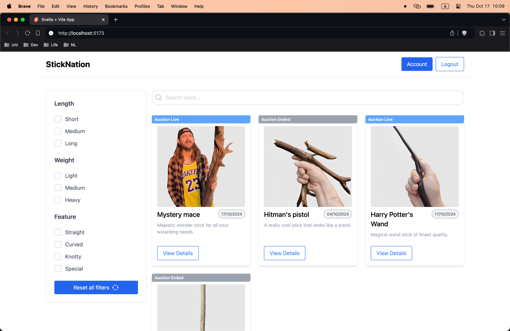

- When clicking on a `View Details` button, the details of the auction are displayed
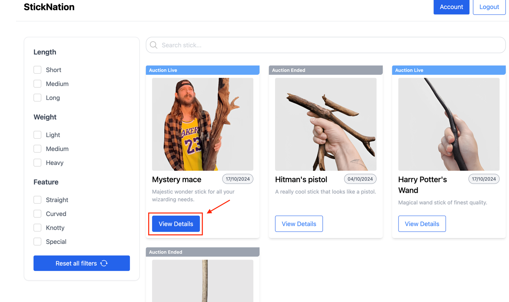

- The mandatory details (end date, bid list, product name, price) are displayed on the screen
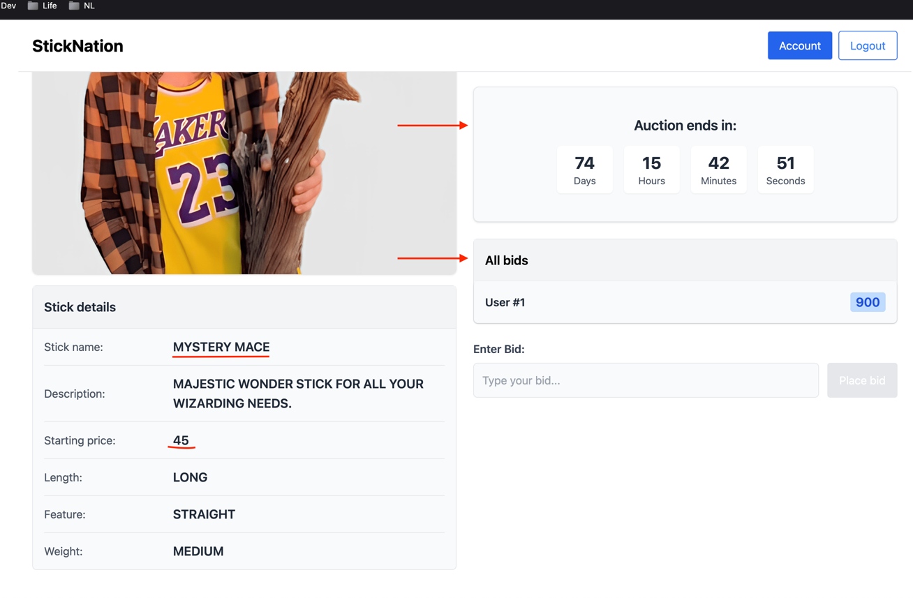

### T2: Search for an auction
- Items are found by the search query `ma`
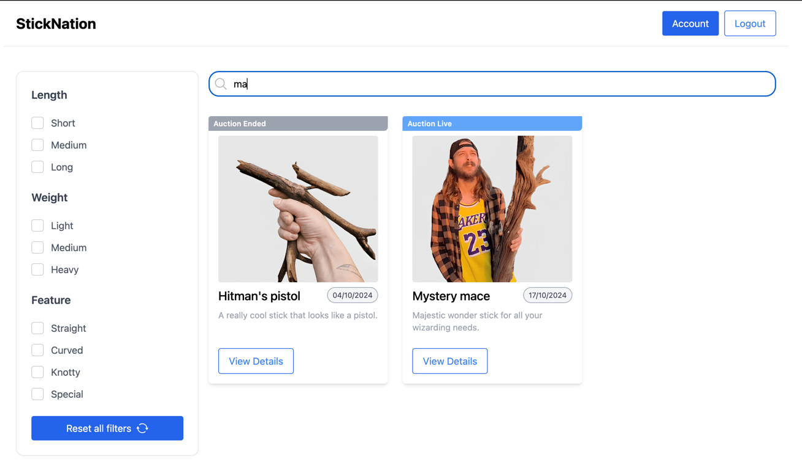

### T3: Bids placement
- The new bids is displayed to both users in real-time
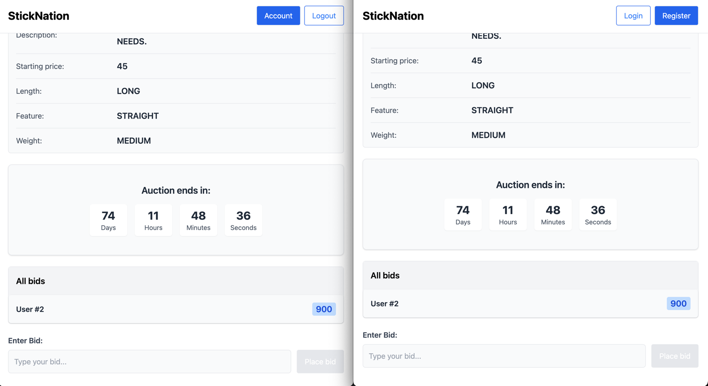

- Not logged-in bidders cannot bid
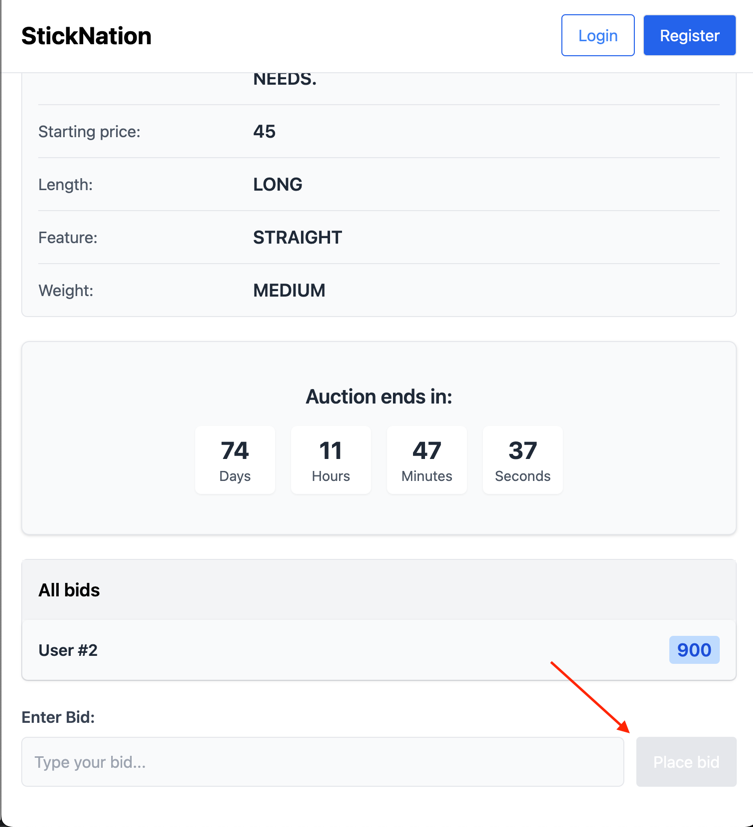

### T4: Filtering auctions
- The correct checkboxes are checked in the filter section and expected item is displayed
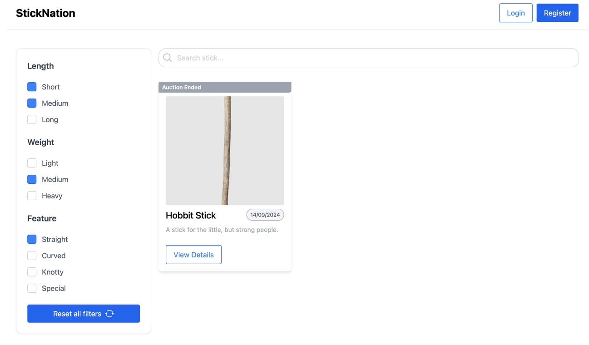

### T5: Client validation when placing bid
- Error message is displayed when inputting a negative number
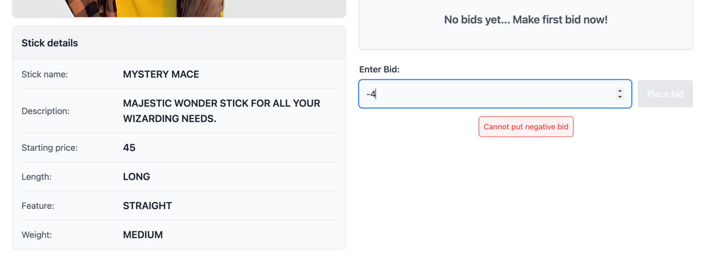

- Error message is displayed when inputting a number that is lower than the starting price bid
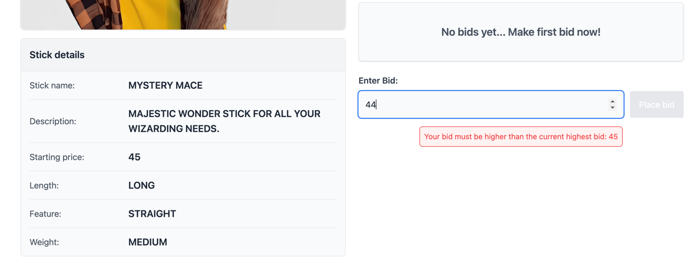

- Error message is displayed when trying to overbid yourself
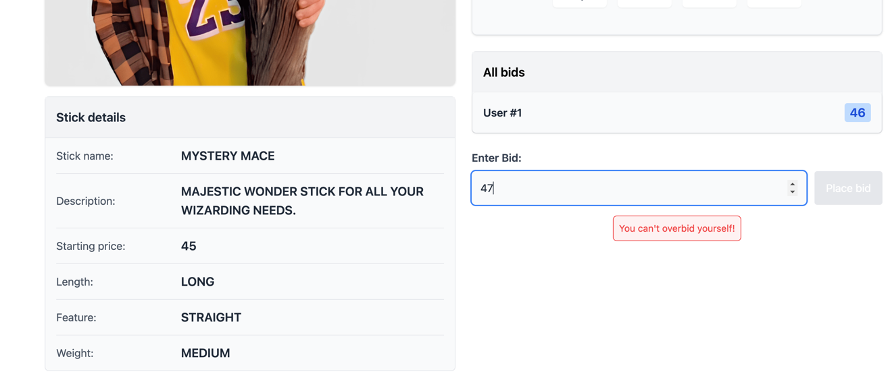

### T6: Managing auctions
- Can access dashboard only as an admin
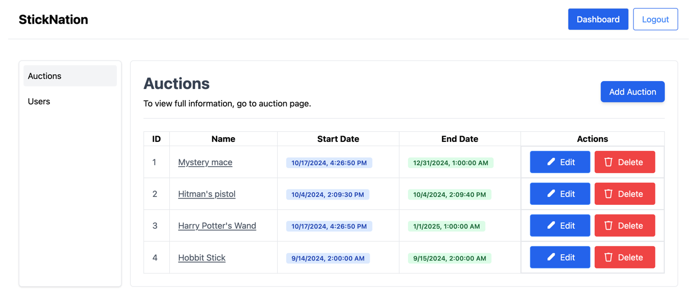

- Can create auctions
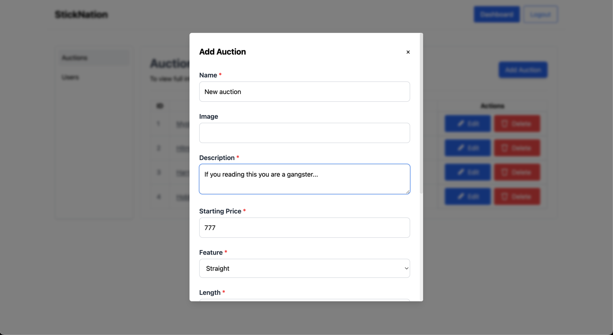

- Can edit auctions
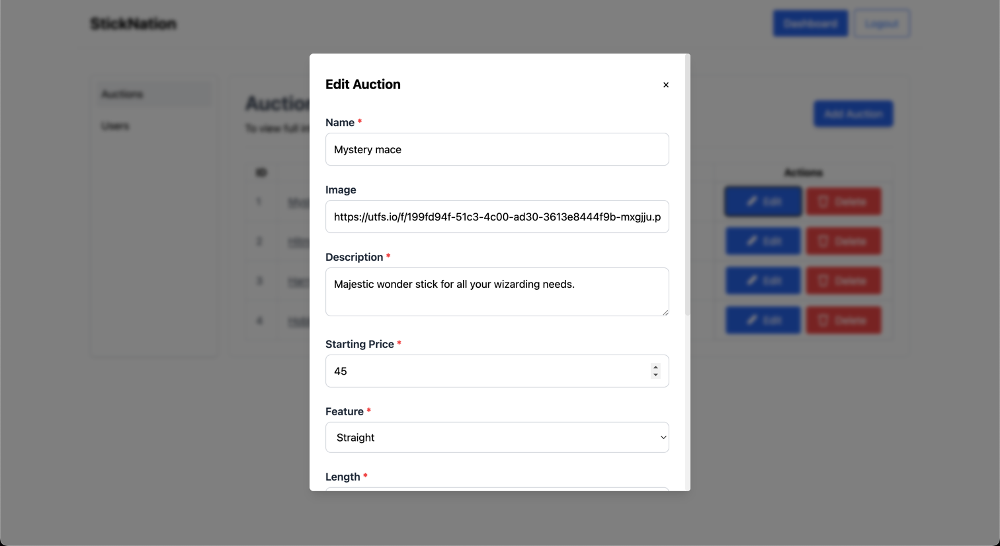

### T7: Testing backend endpoints, server-side validation
- All tests passed successfully
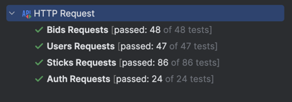
